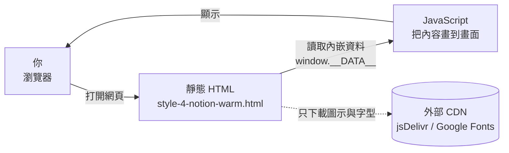

# personal-website（個人作品集網站）架構說明（給非工程師）

> 最後更新：2026/08/06

## 這個專案在做什麼？
這是 Brian 的個人履歷與作品集網站：一個把「關於我、學經歷、專業技能、研究論文、代表專案、聯絡方式」全部放在**一個網頁**上，讓瀏覽履歷的人（例如招募者）打開就能看的靜態網站。主要使用場景是求職與個人品牌展示——內容全部事先寫好，網站本身不跟你互動、不收資料。

## 怎麼使用？
**如果你是「看網站的人」：**
1. 用瀏覽器打開 `style-4-notion-warm.html`（或日後部署後的網址）。
2. 從最上方選單點「About / Experience / Skills / Research / Projects / Contact」，會跳到對應區塊。
3. 想看論文詳細內容：研究發表區的卡片，原始 PDF 放在 `files/` 資料夾。
4. 想看專案：點作品卡片，會連到 `projects/` 底下的頁面——但目前 4 個專案頁面全部是「🚧 專案頁面建置中」的佔位頁（4 個檔案內容完全相同，已逐檔比對確認）。
5. 想聯絡：點 Email 會開啟你的郵件程式（mailto 連結）；電話號碼在畫面上顯示「0979-415-008」，但實際連結中的號碼被隱藏成 `+886****5008`；LinkedIn 按鈕目前是空的（連到 `#`，點了不會去任何地方）。

**如果你是「改內容的人」（Brian 自己）：**
1. 網站內容的「原始來源」是 `data.json`（一個文字檔，用 **JSON** 格式存放所有文字內容）。
2. 改完 `data.json` 後，**還必須**把同樣的內容手動複製進 `style-4-notion-warm.html` 內部的 `window.__DATA__` 區塊（HTML 檔案裡有註解提醒：「編輯 data.json 後請同步此區塊」）——這是因為作者先前為了解決直接用檔案開啟時的 **CORS** 瀏覽器安全限制，把資料直接內嵌進 HTML（見 git 歷史 commit `06b4cda`）。
3. 存檔後重新整理瀏覽器即可看到更新，不需要任何「編譯」步驟。

## 系統由哪些部分組成？
- **前端（你看到的畫面）**：只有一個檔案 `style-4-notion-warm.html`。它同時包含版面的樣式（**CSS**）、把資料填進畫面的程式（**JavaScript**）和內容資料（內嵌的 `window.__DATA__`）。開啟網頁時，JavaScript 會讀取這份內嵌資料，把選單、大頭照、經歷時間軸、技能卡片、論文卡片、作品卡片一一「畫」出來。
- **後端（背後處理的伺服器）**：**無**。這個網站沒有自己的伺服器，程式碼裡找不到任何向伺服器請求資料的指令（已用程式掃描確認：0 個網路請求呼叫）。
- **資料庫（存放資料的地方）**：**無**。所有內容就存放在 `data.json` 和 HTML 內嵌資料這兩份文字檔裡，沒有獨立的資料庫系統。
- **內容素材**：`images/`（大頭照、4 張專案圖、3 張論文示意圖）、`files/`（3 篇論文 PDF，共約 16 MB）、`projects/`（4 個佔位頁）。
- **唯一的外部連線**：網頁會向 **CDN**（內容傳遞網路）下載兩樣東西——jsDelivr 提供的 Phosphor Icons 圖示樣式、Google Fonts 提供的 Inter 字型。這只是「讀取」，不會上傳任何東西。

## 資料怎麼流動與儲存？
這是一個**全程不離開你電腦**的流程：
1. 你雙擊 HTML 檔案（或開啟網站網址）→ 瀏覽器讀取 `style-4-notion-warm.html`。
2. **JavaScript** 讀取內嵌在檔案裡的 `window.__DATA__` 資料 → 把各區塊內容填入畫面。
3. 你點選單連結 → 頁面在「同一個檔案」內跳轉到對應區塊（錨點連結）。
4. 你點 Email／電話 → 瀏覽器呼叫你電腦上的郵件或撥號程式（mailto／tel 連結）。
5. 你點作品卡片 → 跳到 `projects/` 資料夾裡對應的佔位頁。
全程**沒有任何資料被送到任何伺服器**（已掃描確認無任何網路請求指令）；唯一會連網的是向外部 CDN 下載圖示與字型。瀏覽器也沒有使用 **localStorage**（本機小倉庫）——什麼都不記、什麼都不存。

## 登入與權限（如有）
**無**。這是純展示網站，沒有登入功能、沒有會員、沒有管理後台。任何人看到的就是同一份公開內容；要改內容只能直接改檔案。

## 怎麼安裝到新裝置？
這個網站不需要「安裝」，只有兩種情況：
**A. 只是想看網站：**
1. 到 GitHub 的 repo 頁面（`github.com/brian861114-coder/personal-website`，目前是公開 repo，任何人都能看）下載 ZIP 或直接瀏覽檔案。
2. 解壓縮後雙擊 `style-4-notion-warm.html`，瀏覽器就會打開網站。沒網路也能看內容（只是圖示和字型會變成系統預設）。

**B. 想把網站放上網（部署）：**
1. 把整個資料夾（或 clone 下來的 repo）上傳到任一個靜態網頁託管服務。
2. README 提到目標是 **GitHub Pages**（GitHub 的免費網頁託管），但**目前尚未啟用**——實測 `https://brian861114-coder.github.io/personal-website/` 回傳 404，repo 內也找不到任何部署設定檔（無 `.github/` 資料夾、無 CI 設定）。若要用，需到 GitHub repo 的 Settings → Pages 開啟，選 root 分支即可，不需要任何建置步驟。
3. 因為是純靜態網站，也可以丟到任何其他免費靜態託管服務，效果相同。

## 怎麼備份與還原？
- **現況**：**無自動備份**。唯一「備份」是程式碼本身已推上 GitHub 雲端（公開 repo），GitHub 會保存所有歷史版本（目前 13 筆提交紀錄）。
- **要備份什麼**：整個 repo——`style-4-notion-warm.html`、`data.json`、`images/`、`files/`（論文 PDF 有 16 MB，若 GitHub 遺失需自行保留原檔）、`projects/`。
- **還原方式**：若本機檔案毀損，到 GitHub 下載 ZIP 或 `git clone` 即可拿回最新版本；GitHub 的提交歷史可回溯到任何舊版本。
- **提醒**：本機沒有自動備份腳本；若 `data.json` 和 HTML 內嵌資料不同步（改了一邊忘了另一邊），網站會顯示舊內容，這不是「壞掉」，只是需要手動同步。

## 外部依賴清單
| 第三方服務 | 用途 | 免費／付費 | 金鑰或帳密放哪裡 | 如果服務倒了或改價會發生什麼 |
|---|---|---|---|---|
| GitHub（github.com） | 存放網站原始碼與版本歷史 | 免費 | 無（repo 公開，不需要任何金鑰） | 原始碼在雲端的備份消失；若本機也沒留檔，網站就再也找不回來 |
| jsDelivr **CDN** | 提供 Phosphor Icons 圖示的樣式檔 | 免費 | 無 | 圖示樣式載入失敗，頁面上的小圖示消失，其餘內容正常 |
| Google Fonts | 提供 Inter 字型 | 免費 | 無 | 字型載入失敗，瀏覽器改用系統內建字型，畫面仍可讀 |
| GitHub Pages | 網站託管（README 提及的目標） | 免費 | 無 | 目前未啟用（404），無實際影響；日後啟用後若服務停擺，可改放其他靜態託管 |

## 風險提醒
| 風險項目 | 是否適用 | 目前怎麼處理 | 殘留風險 |
|---|---|---|---|
| API 金鑰／密碼外洩 | 否 | repo 內找不到任何金鑰、密碼或 `.env` 設定檔（已掃描確認） | 無 |
| 資料是否公開 | 是 | repo 為公開，網站本身就是「公開給所有人看」的履歷，這是刻意設計 | 姓名、Email、電話、照片、學經歷、公司經歷全部公開，任何人（包含爬蟲）都能取得；電話連結雖部分遮蔽，但畫面上仍顯示完整號碼 |
| 個人資料蒐集 | 否 | 無表單、無追蹤碼、無分析工具（已掃描確認無任何收集資料的程式碼） | 無 |
| 備份與還原缺口 | 是 | 程式碼已推上 GitHub 雲端（含 13 筆歷史版本）；論文 PDF 原檔需自行另外保存 | 無本機自動備份；若 GitHub 帳號或 repo 出問題，且本機檔案同時遺失，則全部內容（含 16 MB PDF）無法還原 |
| 金流相關 | 否 | 網站無任何購物、付款功能 | 無 |
| 資料庫刪除或遷移 | 否 | 無資料庫；刪除風險僅限上述檔案遺失 | 無 |
| 部署與網路暴露 | 是 | 目前 GitHub Pages 未啟用，網站尚未公開上線；即使上線，純靜態頁面攻擊面極小（無後端可入侵） | 若日後啟用 Pages，聯絡資訊與個人資料將正式暴露於公開網路（但目前 repo 本身就是公開的，實質差異不大） |
| 日誌含敏感資訊 | 否 | 網站完全沒有日誌功能 | 無 |

## 壞了怎麼辦？
按順序檢查：
1. **網頁打不開／一片空白** → 直接雙擊 `style-4-notion-warm.html` 用瀏覽器開。若還是空白，多半是檔案內容被改壞（例如內嵌資料的引號沒對好），從 GitHub 下載一份乾淨的版本覆蓋。
2. **網頁正常但沒有圖示、字型怪怪的** → 外部 CDN（jsDelivr／Google Fonts）暫時連不上或服務異常，等恢復即可；不影響任何內容與功能。
3. **畫面內容跟 `data.json` 不一致** → 這是已知的「雙份資料」設計：改 `data.json` 忘了同步 HTML 內嵌的 `window.__DATA__`。把 `data.json` 內容複製進 HTML 的 `window.__DATA__` 區塊即可。
4. **點作品卡片顯示「建置中」** → 不是故障，是專案頁面本來就還沒做好（4 個佔位頁內容相同）。
5. **網站網址打不開（404）** → GitHub Pages 尚未啟用，需到 GitHub repo 的 Settings → Pages 開啟。
6. **整個本機資料夾壞掉** → 到 GitHub repo 頁面下載 ZIP 或 `git clone` 還原。

**自動糾錯機制**：**無**。這是純靜態單檔網站，沒有自動重啟、沒有監控告警、沒有健康檢查——壞了不會自己好，只能靠上面的手動檢查。好處是它幾乎不會「自己壞掉」，因為沒有伺服器在背景跑。

## 架構圖

> 說明：**沒有任何屬於自己的雲端伺服器或資料庫節點**。所有內容都存在 HTML 與 data.json 文字檔裡，唯一的網路連線是向外部 CDN「下載」圖示與字型（單向、不送資料出去）。

## 名詞對照表
| 專有名詞 | 白話解釋 |
|---|---|
| 前端 | 你在瀏覽器看到的畫面與互動部分 |
| 後端 | 在伺服器上處理資料的程式（本專案沒有） |
| 資料庫 | 專門存放大量資料的系統（本專案沒有） |
| 靜態網站 | 內容事先寫好、不會即時變動的網站，不需要伺服器運算 |
| HTML | 描述網頁內容與結構的檔案格式，瀏覽器讀它來顯示畫面 |
| CSS | 描述網頁長相（顏色、排版、字型）的樣式語言 |
| JavaScript | 讓網頁「動起來」的程式語言（本專案用它把資料填進畫面） |
| JSON | 一種把資料整齊排列的純文字格式，`data.json` 就是用這種格式 |
| CDN | 內容傳遞網路：把檔案放在世界各地多處伺服器，讓使用者就近快速下載 |
| GitHub | 存放程式碼與版本歷史的雲端平台（本專案是公開 repo） |
| repo（儲存庫） | 一個專案的所有檔案與修改歷史的統稱 |
| git clone | 把雲端 repo 完整複製一份到本機電腦的指令 |
| GitHub Pages | GitHub 提供的免費靜態網頁託管服務（本專案尚未啟用） |
| CORS | 瀏覽器的一種安全限制；直接開啟本地檔案時可能擋掉讀取外部檔案，因此作者把資料直接內嵌進 HTML 來繞過 |
| API | 程式之間互相呼叫的「服務窗口」（本專案沒用到） |
| localStorage | 瀏覽器內建的「本機小倉庫」，可在不連網的情況下暫存資料（本專案沒用到） |
| mailto／tel 連結 | 點擊後呼叫電腦上郵件程式／撥號程式的超連結 |
| 佔位頁 | 先放著頂位、內容還沒做好（「建置中」）的頁面 |
| CI（持續整合） | 自動化建置與檢查流程（本專案沒有設定） |
